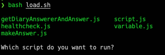

## grafana && influxdb && jaeger

부하 테스트 결과를 시각화하기 위해 grafana와 influxdb를 사용합니다.

tracing으로는 opentelemetry 및 jaeger, Honeycomb를 사용합니다.

`init.sh`를 이용해서 띄워주시면 됩니다.
```bash
bash init.sh
```

## load
부하테스팅 툴로는 k6를 사용하고 있습니다.

`load.sh`를 이용해서 띄워주시면 됩니다.

```
bash load.sh
```


실행하고 싶은 script의 이름을 적으면 됩니다.

## user-data
부하를 주는 서버로 ec2를 사용하고 있습니다.

docker를 매번 수동으로 설치하기엔 너무 귀찮습니다.

user-data를 넣어주면 ec2가 부팅되면서 docker 및 compose를 설치합니다.

## scp

재정적인 관계로 부하를 주는 서버인 ec2는 1회성으로 사용됩니다.

스크립트 및 각종 configuration을 원격 repository로부터 가져와야 하는데, 아직 gomgom repository를 public으로 바꾸는데엔 위험성이 따릅니다.

그렇다고 1회성 서버에 git을 설치하고 ssh key를 인증받고 하는 과정은 귀찮습니다.

이 경우, scp를 사용해서 해결하면 됩니다.

```
scp [-i some.pem] [-r] <file || directory> <ec2-host>@<ip>:<ec2 path>
```
